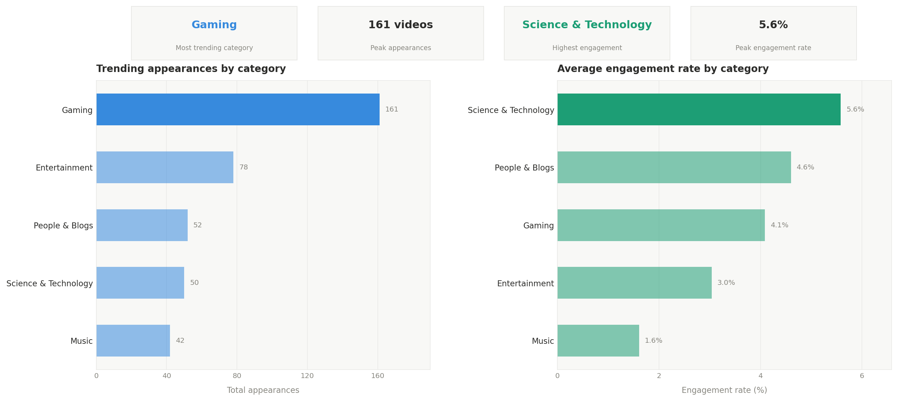
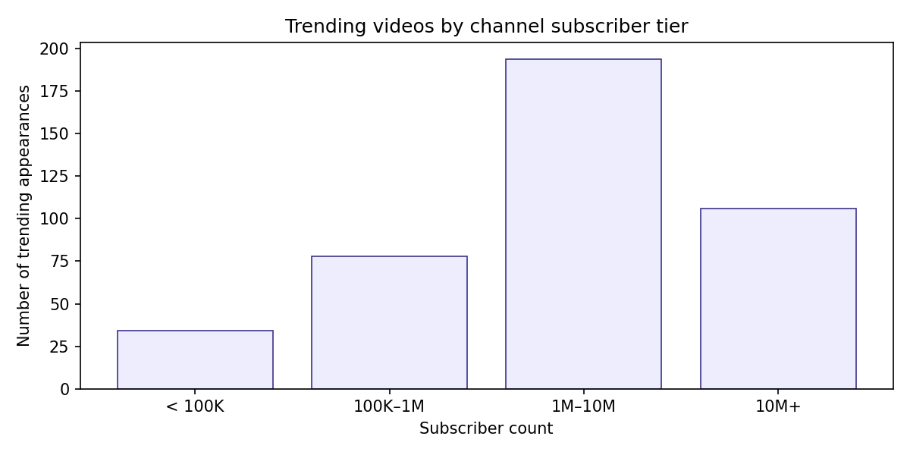
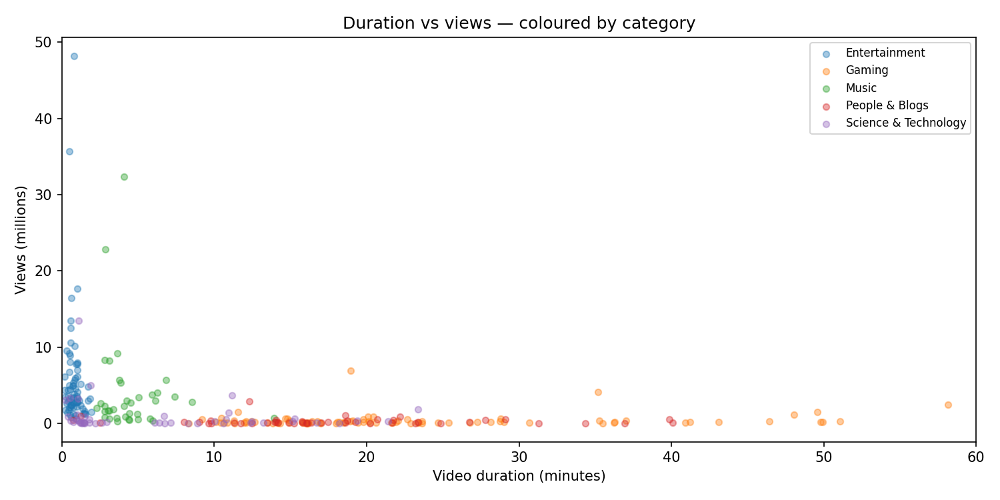
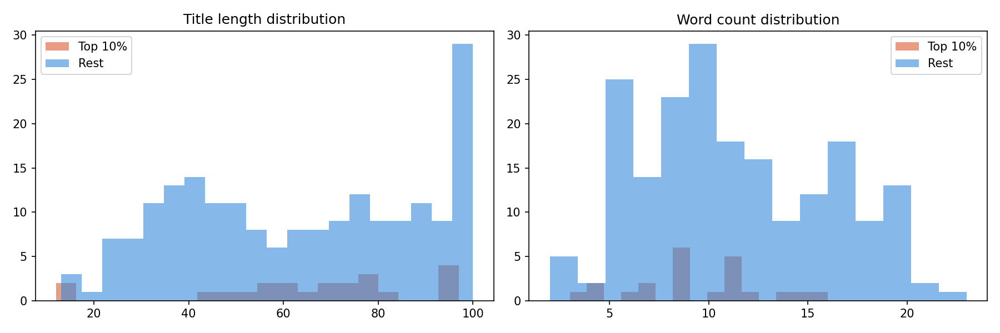
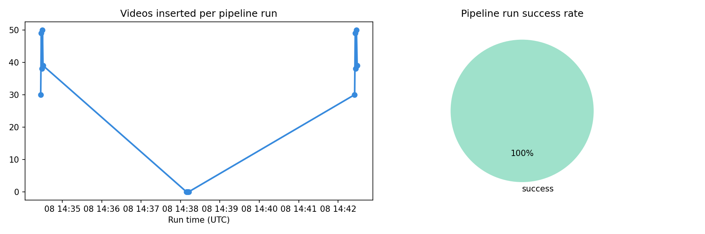

# YouTube Trending ETL Pipeline
### Automated Data Pipeline & Behavioural Analysis — India Trending Videos


---

## What It Does

An automated ETL pipeline that extracts India's top trending YouTube videos across **5 categories** using the YouTube Data API v3, cleans and enriches the data with computed engagement metrics, and loads it into a PostgreSQL database. The pipeline ran across **3 days** collecting data multiple times daily with **100% success rate** — producing a dataset of **383 unique videos** used for downstream behavioural analysis.

---

## Architecture

```
YouTube Data API v3
       ↓
  extract.py        → pulls top 50 trending videos per category
       ↓
  transform.py      → cleans data, parses ISO 8601 durations,
                      engineers features (engagement rate,
                      title length, has_numbers, days_since_publish)
       ↓
  load.py           → upserts into PostgreSQL via ON CONFLICT DO NOTHING
                      logs every run to pipeline_runs table
       ↓
  run_once.py       → orchestrates full ETL + channel stats extraction
       ↓
  PostgreSQL DB     → trending_videos | channel_stats | pipeline_runs
       ↓
  Jupyter Notebook  → 5 analyses with visualisations
```

---

## Key Findings

### 1. Category Analysis

- **Gaming dominates** India trending with **161 appearances** — 2x more than Entertainment (78)
- Despite fewer appearances, **Science & Technology** has the **highest engagement rate at 5.6%**
- Music has the **lowest engagement rate (1.6%)** — viewers watch but don't interact
- Insight: Gaming content is easiest to trend in India, but Science & Tech builds the most engaged audience

### 2. Channel Size vs Trending

- **1M–10M subscriber channels** dominate trending with **178 appearances**
- **38 videos (10% of dataset)** came from channels with **< 100K subscribers** — small creators do break through
- Larger channels (10M+) average **4.4M views** per trending video vs 1.1M for small channels
- 1M–10M tier has the **highest engagement rate (4.52%)** — the sweet spot for growth

### 3. Video Duration vs Views

- Strong **negative correlation** across most categories — shorter videos get more views
- Exception: **Gaming shows a slight positive correlation (+0.151)** — longer gaming videos perform better
- Most high-view videos cluster under **5 minutes** in duration
- Insight: Keep videos under 5 mins for max reach, except in Gaming where longer content is rewarded

### 4. Title Patterns — Top 10% vs Rest

- Top 10% videos average **65.6 character titles** vs 62.4 for the rest — marginally longer
- Top 10% use **9.4 words** vs 11.1 for the rest — fewer but more impactful words
- Insight: Concise, punchy titles (fewer words, moderate length) correlate with higher views

### 5. Pipeline Health

- **35 total runs** over 3 days
- **100% success rate** — zero failed runs
- **383 videos inserted**, **1,032 skipped** (duplicates handled by upsert logic)
- Average **10.9 new videos per run** — shows healthy daily trending rotation

---

## Business Recommendations

1. **For creators targeting India trending:** Focus on Gaming or Science & Tech. Gaming has volume, Science & Tech has engagement.
2. **Optimal video length:** Stay under 5 minutes for most categories. Gaming is the exception — longer content performs better there.
3. **Title strategy:** Aim for 60–70 characters, 9–10 words. Avoid over-stuffing titles.
4. **Channel growth window:** The 100K–1M subscriber range is underrepresented in trending (80 appearances) vs 1M–10M (178). Crossing 1M subs significantly improves trending chances.

---

## Tech Stack

| Tool | Purpose |
|---|---|
| Python 3.13 | Core pipeline language |
| YouTube Data API v3 | Data extraction |
| pandas | Data transformation & analysis |
| SQLAlchemy + psycopg2 | PostgreSQL ORM & connection |
| PostgreSQL | Data warehouse |
| isodate | ISO 8601 duration parsing |
| matplotlib + seaborn | Visualisations |
| scipy | Statistical correlation testing |

---

## Database Schema

```sql
trending_videos     -- 383 unique videos with engagement metrics
channel_stats       -- 204 unique channels with subscriber counts
pipeline_runs       -- 35 logged runs with insert/skip counts
```

---

## Project Structure

```
youtube-etl-pipeline/
├── etl/
│   ├── __init__.py
│   ├── extract.py        ← YouTube API calls + channel stats
│   ├── transform.py      ← cleaning, duration parsing, feature engineering
│   └── load.py           ← upsert to PostgreSQL + pipeline run logging
├── analysis/
│   ├── youtube_analysis.ipynb
│   ├── category_analysis.png
│   ├── channel_size_analysis.png
│   ├── duration_vs_views.png
│   ├── pipeline_health.png
│   └── title_patterns.png
├── sql/
│   └── create_tables.sql
├── logs/
│   └── pipeline.log
├── run_once.py           ← single pipeline run (used for scheduling)
├── config.py             ← API key + DB config (gitignored)
├── requirements.txt
├── .gitignore
└── README.md
```

---

## How to Run

```bash
# 1. Clone the repo
git clone https://github.com/YOUR_USERNAME/youtube-etl-pipeline.git
cd youtube-etl-pipeline

# 2. Create virtual environment
python -m venv .venv
.venv/Scripts/activate        # Windows
source .venv/bin/activate     # Mac/Linux

# 3. Install dependencies
pip install -r requirements.txt

# 4. Add your credentials to config.py
#    YOUTUBE_API_KEY = "AIzaSy..."
#    DB_CONFIG = { host, port, database, user, password }

# 5. Create PostgreSQL database and tables
psql -U postgres -c "CREATE DATABASE youtube_etl;"
psql -U postgres -d youtube_etl -f sql/create_tables.sql

# 6. Run the pipeline
python run_once.py
```

---

## Requirements

```
google-api-python-client
pandas
sqlalchemy
psycopg2-binary
isodate
matplotlib
seaborn
scipy
```

---

## What I Learned

- Designing a modular ETL pipeline with separation of extract, transform, and load concerns
- Parsing non-standard ISO 8601 duration formats from the YouTube API
- Implementing upsert logic (`ON CONFLICT DO NOTHING`) for idempotent pipeline runs
- Engineering features from raw API data (engagement rate, like ratio, days since publish)
- Tracking pipeline observability via a `pipeline_runs` audit table
- Extracting business insights from real-world social media data

---

*Dataset: India (IN) trending videos | Categories: Music, Gaming, People & Blogs, Entertainment, Science & Technology | Period: 3 days 
